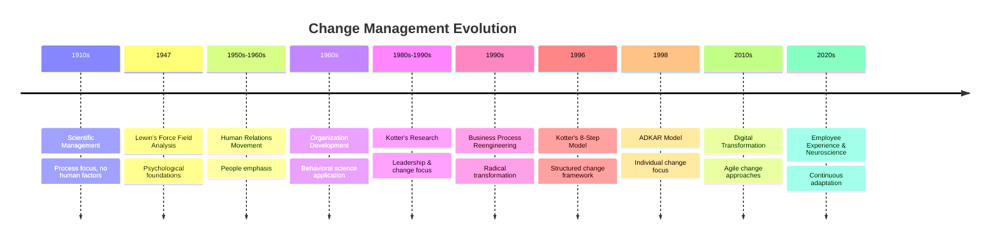

```mermaid
timeline
    title Change Management Evolution
    1910s : Scientific Management
          : Process focus, no human factors
    1947 : Lewin's Force Field Analysis
         : Psychological foundations
    1950s-1960s : Human Relations Movement
                : People emphasis
    1960s : Organization Development
          : Behavioral science application
    1980s-1990s : Kotter's Research
                : Leadership & change focus
    1990s : Business Process Reengineering
          : Radical transformation
    1996 : Kotter's 8-Step Model
         : Structured change framework
    1998 : ADKAR Model
         : Individual change focus
    2010s : Digital Transformation
          : Agile change approaches
    2020s : Employee Experience & Neuroscience
          : Continuous adaptation
```
