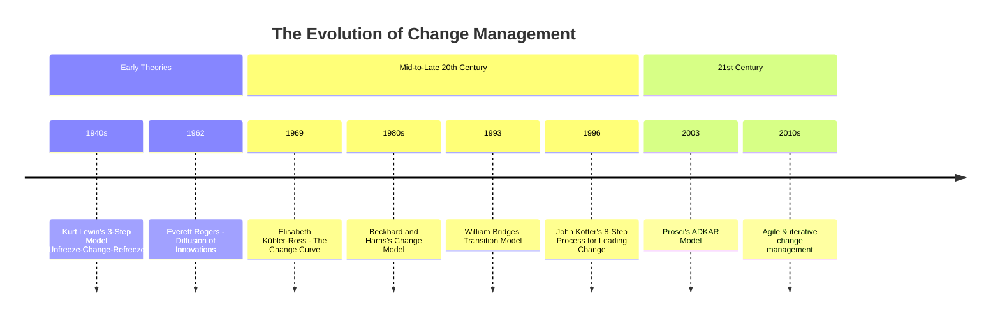

```mermaid
timeline
    title The Evolution of Change Management
    section Early Theories
        1940s : Kurt Lewin's 3-Step Model (Unfreeze-Change-Refreeze)
        1962 : Everett Rogers - Diffusion of Innovations
    section Mid-to-Late 20th Century
        1969 : Elisabeth Kübler-Ross - The Change Curve
        1980s : Beckhard and Harris's Change Model
        1993 : William Bridges' Transition Model
        1996 : John Kotter's 8-Step Process for Leading Change
    section 21st Century
        2003 : Prosci's ADKAR Model
        2010s : Agile & iterative change management
```
