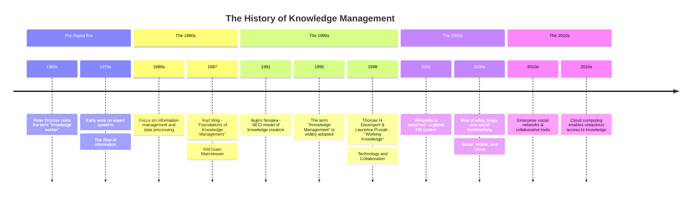

```mermaid
timeline
    title The History of Knowledge Management
    section Pre-Digital Era
        1960s : Peter Drucker coins the term "knowledge worker"
        1970s : Early work on expert systems
    section The 1980s: The Rise of Information
        1980s : Focus on information management and data processing
        1987 : Karl Wiig - "Foundations of Knowledge Management"
    section The 1990s: KM Goes Mainstream
        1991 : Ikujiro Nonaka - SECI model of knowledge creation
        1995 : The term "Knowledge Management" is widely adopted
        1998 : Thomas H. Davenport & Laurence Prusak - "Working Knowledge"
    section The 2000s: Technology and Collaboration
        2001 : Wikipedia is launched - a global KM system
        2000s : Rise of wikis, blogs, and social bookmarking
    section The 2010s: Social, Mobile, and Cloud
        2010s : Enterprise social networks & collaborative tools
        2010s : Cloud computing enables ubiquitous access to knowledge
```
