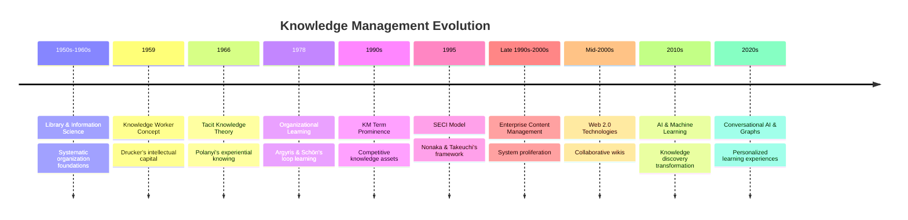

```mermaid
timeline
    title Knowledge Management Evolution
    1950s-1960s : Library & Information Science
                : Systematic organization foundations
    1959 : Knowledge Worker Concept
         : Drucker's intellectual capital
    1966 : Tacit Knowledge Theory
         : Polanyi's experiential knowing
    1978 : Organizational Learning
         : Argyris & Schön's loop learning
    1990s : KM Term Prominence
          : Competitive knowledge assets
    1995 : SECI Model
         : Nonaka & Takeuchi's framework
    Late 1990s-2000s : Enterprise Content Management
                     : System proliferation
    Mid-2000s : Web 2.0 Technologies
              : Collaborative wikis
    2010s : AI & Machine Learning
          : Knowledge discovery transformation
    2020s : Conversational AI & Graphs
          : Personalized learning experiences
```
