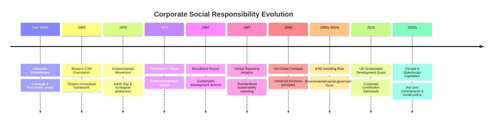

```mermaid
timeline
    title Corporate Social Responsibility Evolution
    Late 1800s : Corporate Philanthropy
               : Carnegie & Rockefeller giving
    1953 : Bowen's CSR Foundation
         : Modern conceptual framework
    1970 : Environmental Movement
         : Earth Day & ecological awareness
    1970 : Friedman's Critique
         : Profit maximization debate
    1987 : Brundtland Report
         : Sustainable development defined
    1997 : Global Reporting Initiative
         : Standardized sustainability reporting
    2000 : UN Global Compact
         : Universal business principles
    2000s-2010s : ESG Investing Rise
                : Environmental-social-governance focus
    2015 : UN Sustainable Development Goals
         : Corporate contribution framework
    2020s : Climate & Stakeholder Capitalism
          : Net-zero commitments & social justice
```
