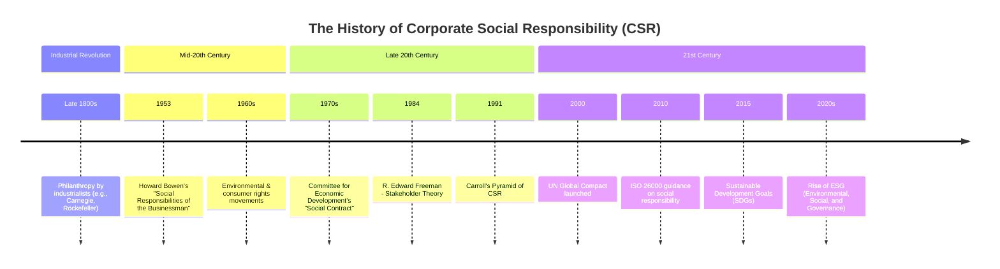

```mermaid
timeline
    title The History of Corporate Social Responsibility (CSR)
    section Industrial Revolution
        Late 1800s : Philanthropy by industrialists (e.g., Carnegie, Rockefeller)
    section Mid-20th Century
        1953 : Howard Bowen's "Social Responsibilities of the Businessman"
        1960s : Environmental & consumer rights movements
    section Late 20th Century
        1970s : Committee for Economic Development's "Social Contract"
        1984 : R. Edward Freeman - Stakeholder Theory
        1991 : Carroll's Pyramid of CSR
    section 21st Century
        2000 : UN Global Compact launched
        2010 : ISO 26000 guidance on social responsibility
        2015 : Sustainable Development Goals (SDGs)
        2020s : Rise of ESG (Environmental, Social, and Governance)
```
