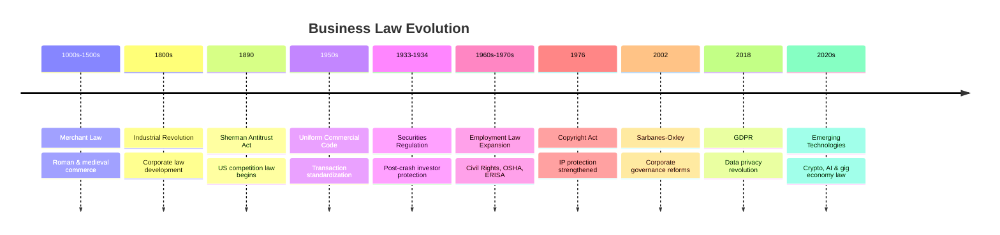

```mermaid
timeline
    title Business Law Evolution
    1000s-1500s : Merchant Law
                : Roman & medieval commerce
    1800s : Industrial Revolution
          : Corporate law development
    1890 : Sherman Antitrust Act
         : US competition law begins
    1950s : Uniform Commercial Code
          : Transaction standardization
    1933-1934 : Securities Regulation
              : Post-crash investor protection
    1960s-1970s : Employment Law Expansion
                : Civil Rights, OSHA, ERISA
    1976 : Copyright Act
         : IP protection strengthened
    2002 : Sarbanes-Oxley
         : Corporate governance reforms
    2018 : GDPR
         : Data privacy revolution
    2020s : Emerging Technologies
          : Crypto, AI & gig economy law
```
