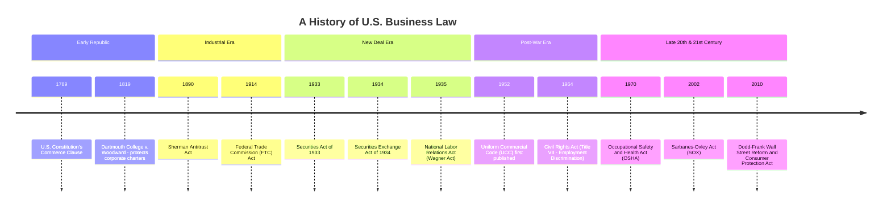

```mermaid
timeline
    title A History of U.S. Business Law
    section Early Republic
        1789 : U.S. Constitution's Commerce Clause
        1819 : Dartmouth College v. Woodward - protects corporate charters
    section Industrial Era
        1890 : Sherman Antitrust Act
        1914 : Federal Trade Commission (FTC) Act
    section New Deal Era
        1933 : Securities Act of 1933
        1934 : Securities Exchange Act of 1934
        1935 : National Labor Relations Act (Wagner Act)
    section Post-War Era
        1952 : Uniform Commercial Code (UCC) first published
        1964 : Civil Rights Act (Title VII - Employment Discrimination)
    section Late 20th & 21st Century
        1970 : Occupational Safety and Health Act (OSHA)
        2002 : Sarbanes-Oxley Act (SOX)
        2010 : Dodd-Frank Wall Street Reform and Consumer Protection Act
```
