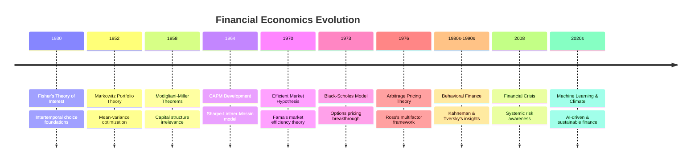

```mermaid
timeline
    title Financial Economics Evolution
    1930 : Fisher's Theory of Interest
         : Intertemporal choice foundations
    1952 : Markowitz Portfolio Theory
         : Mean-variance optimization
    1958 : Modigliani-Miller Theorems
         : Capital structure irrelevance
    1964 : CAPM Development
         : Sharpe-Lintner-Mossin model
    1970 : Efficient Market Hypothesis
         : Fama's market efficiency theory
    1973 : Black-Scholes Model
         : Options pricing breakthrough
    1976 : Arbitrage Pricing Theory
         : Ross's multifactor framework
    1980s-1990s : Behavioral Finance
                : Kahneman & Tversky's insights
    2008 : Financial Crisis
         : Systemic risk awareness
    2020s : Machine Learning & Climate
          : AI-driven & sustainable finance
```
