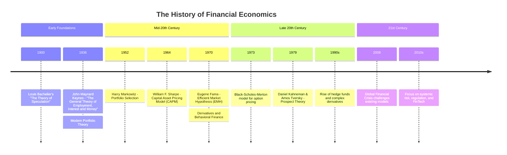

```mermaid
timeline
    title The History of Financial Economics
    section Early Foundations
        1900 : Louis Bachelier's "The Theory of Speculation"
        1936 : John Maynard Keynes - "The General Theory of Employment, Interest and Money"
    section Mid-20th Century: Modern Portfolio Theory
        1952 : Harry Markowitz - Portfolio Selection
        1964 : William F. Sharpe - Capital Asset Pricing Model (CAPM)
        1970 : Eugene Fama - Efficient Market Hypothesis (EMH)
    section Late 20th Century: Derivatives and Behavioral Finance
        1973 : Black-Scholes-Merton model for option pricing
        1979 : Daniel Kahneman & Amos Tversky - Prospect Theory
        1990s : Rise of hedge funds and complex derivatives
    section 21st Century
        2008 : Global Financial Crisis challenges existing models
        2010s : Focus on systemic risk, regulation, and FinTech
```
