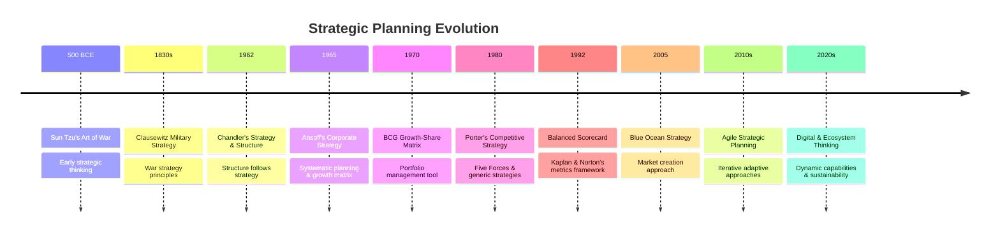

```mermaid
timeline
    title Strategic Planning Evolution
    500 BCE : Sun Tzu's Art of War
            : Early strategic thinking
    1830s : Clausewitz Military Strategy
          : War strategy principles
    1962 : Chandler's Strategy & Structure
         : Structure follows strategy
    1965 : Ansoff's Corporate Strategy
         : Systematic planning & growth matrix
    1970 : BCG Growth-Share Matrix
         : Portfolio management tool
    1980 : Porter's Competitive Strategy
         : Five Forces & generic strategies
    1992 : Balanced Scorecard
         : Kaplan & Norton's metrics framework
    2005 : Blue Ocean Strategy
         : Market creation approach
    2010s : Agile Strategic Planning
          : Iterative adaptive approaches
    2020s : Digital & Ecosystem Thinking
          : Dynamic capabilities & sustainability
```
