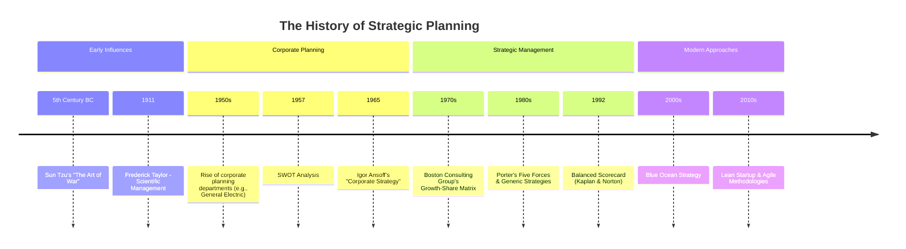

```mermaid
timeline
    title The History of Strategic Planning
    section Early Influences
        5th Century BC : Sun Tzu's "The Art of War"
        1911 : Frederick Taylor - Scientific Management
    section Corporate Planning
        1950s : Rise of corporate planning departments (e.g., General Electric)
        1957 : SWOT Analysis
        1965 : Igor Ansoff's "Corporate Strategy"
    section Strategic Management
        1970s : Boston Consulting Group's Growth-Share Matrix
        1980s : Porter's Five Forces & Generic Strategies
        1992 : Balanced Scorecard (Kaplan & Norton)
    section Modern Approaches
        2000s : Blue Ocean Strategy
        2010s : Lean Startup & Agile Methodologies
```
