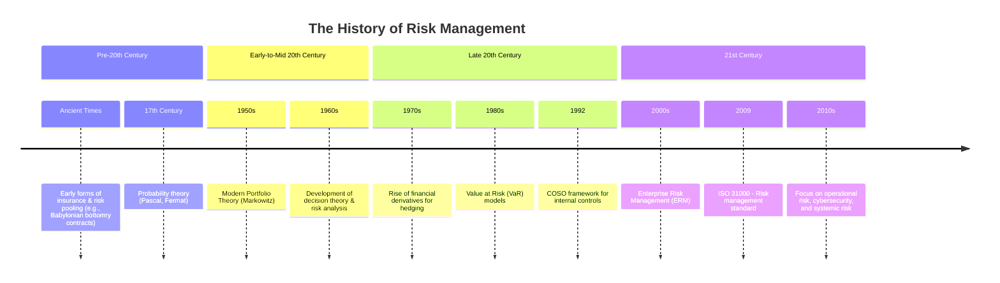

```mermaid
timeline
    title The History of Risk Management
    section Pre-20th Century
        Ancient Times : Early forms of insurance & risk pooling (e.g., Babylonian bottomry contracts)
        17th Century : Probability theory (Pascal, Fermat)
    section Early-to-Mid 20th Century
        1950s : Modern Portfolio Theory (Markowitz)
        1960s : Development of decision theory & risk analysis
    section Late 20th Century
        1970s : Rise of financial derivatives for hedging
        1980s : Value at Risk (VaR) models
        1992 : COSO framework for internal controls
    section 21st Century
        2000s : Enterprise Risk Management (ERM)
        2009 : ISO 31000 - Risk management standard
        2010s : Focus on operational risk, cybersecurity, and systemic risk
```
