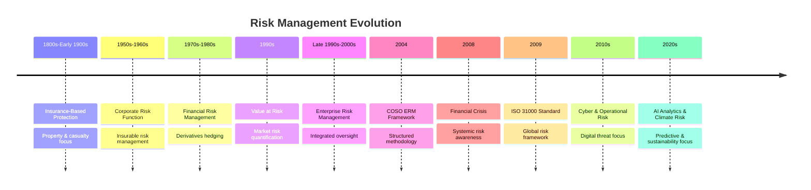

```mermaid
timeline
    title Risk Management Evolution
    1800s-Early 1900s : Insurance-Based Protection
                      : Property & casualty focus
    1950s-1960s : Corporate Risk Function
                : Insurable risk management
    1970s-1980s : Financial Risk Management
                : Derivatives hedging
    1990s : Value at Risk
          : Market risk quantification
    Late 1990s-2000s : Enterprise Risk Management
                     : Integrated oversight
    2004 : COSO ERM Framework
         : Structured methodology
    2008 : Financial Crisis
         : Systemic risk awareness
    2009 : ISO 31000 Standard
         : Global risk framework
    2010s : Cyber & Operational Risk
          : Digital threat focus
    2020s : AI Analytics & Climate Risk
          : Predictive & sustainability focus
```
