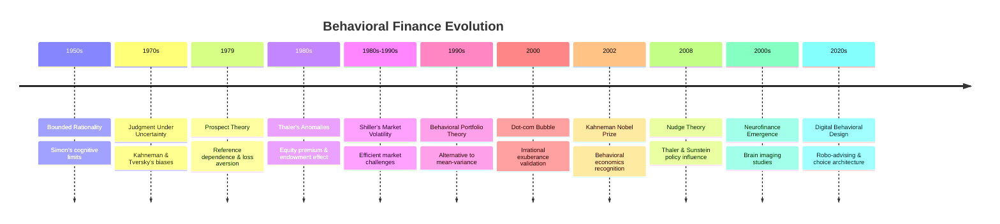

```mermaid
timeline
    title Behavioral Finance Evolution
    1950s : Bounded Rationality
          : Simon's cognitive limits
    1970s : Judgment Under Uncertainty
          : Kahneman & Tversky's biases
    1979 : Prospect Theory
         : Reference dependence & loss aversion
    1980s : Thaler's Anomalies
          : Equity premium & endowment effect
    1980s-1990s : Shiller's Market Volatility
                : Efficient market challenges
    1990s : Behavioral Portfolio Theory
          : Alternative to mean-variance
    2000 : Dot-com Bubble
         : Irrational exuberance validation
    2002 : Kahneman Nobel Prize
         : Behavioral economics recognition
    2008 : Nudge Theory
         : Thaler & Sunstein policy influence
    2000s : Neurofinance Emergence
          : Brain imaging studies
    2020s : Digital Behavioral Design
          : Robo-advising & choice architecture
```
