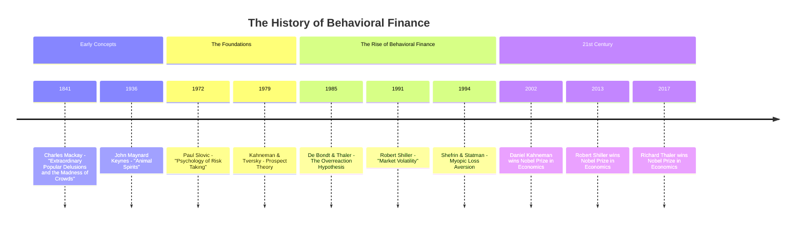

```mermaid
timeline
    title The History of Behavioral Finance
    section Early Concepts
        1841 : Charles Mackay - "Extraordinary Popular Delusions and the Madness of Crowds"
        1936 : John Maynard Keynes - "Animal Spirits"
    section The Foundations
        1972 : Paul Slovic - "Psychology of Risk Taking"
        1979 : Kahneman & Tversky - Prospect Theory
    section The Rise of Behavioral Finance
        1985 : De Bondt & Thaler - The Overreaction Hypothesis
        1991 : Robert Shiller - "Market Volatility"
        1994 : Shefrin & Statman - Myopic Loss Aversion
    section 21st Century
        2002 : Daniel Kahneman wins Nobel Prize in Economics
        2013 : Robert Shiller wins Nobel Prize in Economics
        2017 : Richard Thaler wins Nobel Prize in Economics
```
