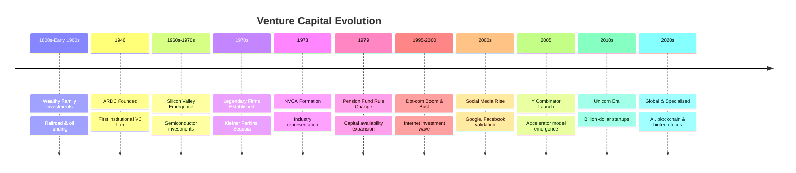

```mermaid
timeline
    title Venture Capital Evolution
    1800s-Early 1900s : Wealthy Family Investments
                      : Railroad & oil funding
    1946 : ARDC Founded
         : First institutional VC firm
    1960s-1970s : Silicon Valley Emergence
                : Semiconductor investments
    1970s : Legendary Firms Established
          : Kleiner Perkins, Sequoia
    1973 : NVCA Formation
         : Industry representation
    1979 : Pension Fund Rule Change
         : Capital availability expansion
    1995-2000 : Dot-com Boom & Bust
              : Internet investment wave
    2000s : Social Media Rise
          : Google, Facebook validation
    2005 : Y Combinator Launch
         : Accelerator model emergence
    2010s : Unicorn Era
          : Billion-dollar startups
    2020s : Global & Specialized
          : AI, blockchain & biotech focus
```
