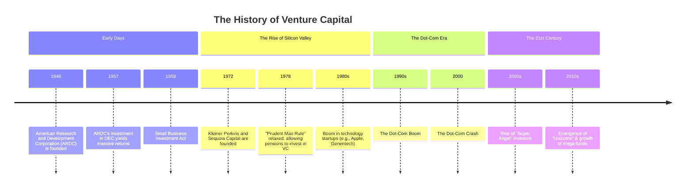

```mermaid
timeline
    title The History of Venture Capital
    section Early Days
        1946 : American Research and Development Corporation (ARDC) is founded
        1957 : ARDC's investment in DEC yields massive returns
        1958 : Small Business Investment Act
    section The Rise of Silicon Valley
        1972 : Kleiner Perkins and Sequoia Capital are founded
        1978 : "Prudent Man Rule" relaxed, allowing pensions to invest in VC
        1980s : Boom in technology startups (e.g., Apple, Genentech)
    section The Dot-Com Era
        1990s : The Dot-Com Boom
        2000 : The Dot-Com Crash
    section The 21st Century
        2000s : Rise of "Super Angel" investors
        2010s : Emergence of "Unicorns" & growth of mega-funds
```
