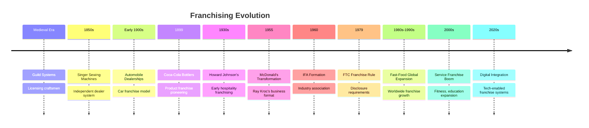

```mermaid
timeline
    title Franchising Evolution
    Medieval Era : Guild Systems
                 : Licensing craftsmen
    1850s : Singer Sewing Machines
          : Independent dealer system
    Early 1900s : Automobile Dealerships
                : Car franchise model
    1899 : Coca-Cola Bottlers
         : Product franchise pioneering
    1930s : Howard Johnson's
          : Early hospitality franchising
    1955 : McDonald's Transformation
         : Ray Kroc's business format
    1960 : IFA Formation
         : Industry association
    1979 : FTC Franchise Rule
         : Disclosure requirements
    1980s-1990s : Fast-Food Global Expansion
                : Worldwide franchise growth
    2000s : Service Franchise Boom
          : Fitness, education expansion
    2020s : Digital Integration
          : Tech-enabled franchise systems
```
