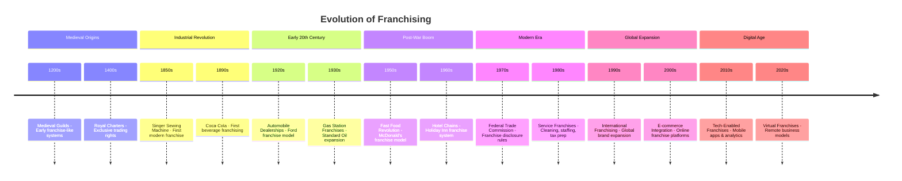

```mermaid
timeline
    title Evolution of Franchising
    section Medieval Origins
        1200s : Medieval Guilds - Early franchise-like systems
        1400s : Royal Charters - Exclusive trading rights
    section Industrial Revolution
        1850s : Singer Sewing Machine - First modern franchise
        1890s : Coca-Cola - First beverage franchising
    section Early 20th Century
        1920s : Automobile Dealerships - Ford franchise model
        1930s : Gas Station Franchises - Standard Oil expansion
    section Post-War Boom
        1950s : Fast Food Revolution - McDonald's franchise model
        1960s : Hotel Chains - Holiday Inn franchise system
    section Modern Era
        1970s : Federal Trade Commission - Franchise disclosure rules
        1980s : Service Franchises - Cleaning, staffing, tax prep
    section Global Expansion
        1990s : International Franchising - Global brand expansion
        2000s : E-commerce Integration - Online franchise platforms
    section Digital Age
        2010s : Tech-Enabled Franchises - Mobile apps & analytics
        2020s : Virtual Franchises - Remote business models
```
