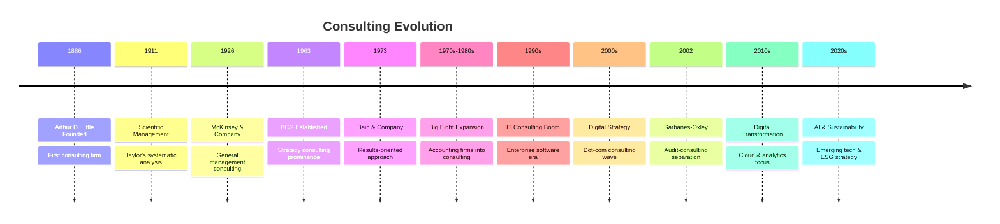

```mermaid
timeline
    title Consulting Evolution
    1886 : Arthur D. Little Founded
         : First consulting firm
    1911 : Scientific Management
         : Taylor's systematic analysis
    1926 : McKinsey & Company
         : General management consulting
    1963 : BCG Established
         : Strategy consulting prominence
    1973 : Bain & Company
         : Results-oriented approach
    1970s-1980s : Big Eight Expansion
                : Accounting firms into consulting
    1990s : IT Consulting Boom
          : Enterprise software era
    2000s : Digital Strategy
          : Dot-com consulting wave
    2002 : Sarbanes-Oxley
         : Audit-consulting separation
    2010s : Digital Transformation
          : Cloud & analytics focus
    2020s : AI & Sustainability
          : Emerging tech & ESG strategy
```
