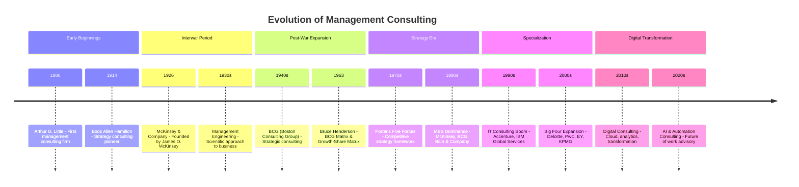

```mermaid
timeline
    title Evolution of Management Consulting
    section Early Beginnings
        1886 : Arthur D. Little - First management consulting firm
        1914 : Booz Allen Hamilton - Strategy consulting pioneer
    section Interwar Period
        1926 : McKinsey & Company - Founded by James O. McKinsey
        1930s : Management Engineering - Scientific approach to business
    section Post-War Expansion
        1940s : BCG (Boston Consulting Group) - Strategic consulting
        1963 : Bruce Henderson - BCG Matrix & Growth-Share Matrix
    section Strategy Era
        1970s : Porter's Five Forces - Competitive strategy framework
        1980s : MBB Dominance - McKinsey, BCG, Bain & Company
    section Specialization
        1990s : IT Consulting Boom - Accenture, IBM Global Services
        2000s : Big Four Expansion - Deloitte, PwC, EY, KPMG
    section Digital Transformation
        2010s : Digital Consulting - Cloud, analytics, transformation
        2020s : AI & Automation Consulting - Future of work advisory
```
