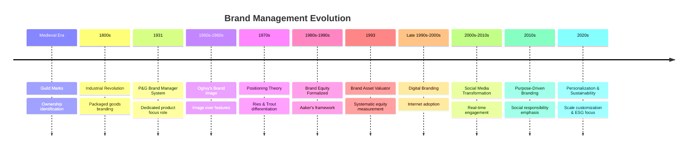

```mermaid
timeline
    title Brand Management Evolution
    Medieval Era : Guild Marks
                 : Ownership identification
    1800s : Industrial Revolution
          : Packaged goods branding
    1931 : P&G Brand Manager System
         : Dedicated product focus role
    1950s-1960s : Ogilvy's Brand Image
                : Image over features
    1970s : Positioning Theory
          : Ries & Trout differentiation
    1980s-1990s : Brand Equity Formalized
                : Aaker's framework
    1993 : Brand Asset Valuator
         : Systematic equity measurement
    Late 1990s-2000s : Digital Branding
                     : Internet adoption
    2000s-2010s : Social Media Transformation
                : Real-time engagement
    2010s : Purpose-Driven Branding
          : Social responsibility emphasis
    2020s : Personalization & Sustainability
          : Scale customization & ESG focus
```
