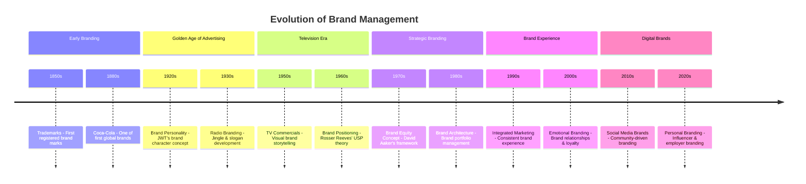

```mermaid
timeline
    title Evolution of Brand Management
    section Early Branding
        1850s : Trademarks - First registered brand marks
        1880s : Coca-Cola - One of first global brands
    section Golden Age of Advertising
        1920s : Brand Personality - JWT's brand character concept
        1930s : Radio Branding - Jingle & slogan development
    section Television Era
        1950s : TV Commercials - Visual brand storytelling
        1960s : Brand Positioning - Rosser Reeves' USP theory
    section Strategic Branding
        1970s : Brand Equity Concept - David Aaker's framework
        1980s : Brand Architecture - Brand portfolio management
    section Brand Experience
        1990s : Integrated Marketing - Consistent brand experience
        2000s : Emotional Branding - Brand relationships & loyalty
    section Digital Brands
        2010s : Social Media Brands - Community-driven branding
        2020s : Personal Branding - Influencer & employer branding
```
