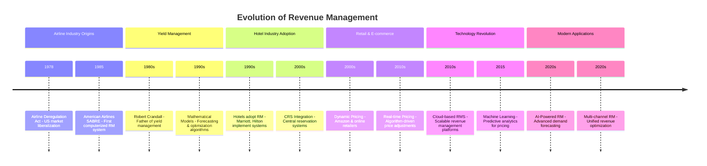

```mermaid
timeline
    title Evolution of Revenue Management
    section Airline Industry Origins
        1978 : Airline Deregulation Act - US market liberalization
        1985 : American Airlines SABRE - First computerized RM system
    section Yield Management
        1980s : Robert Crandall - Father of yield management
        1990s : Mathematical Models - Forecasting & optimization algorithms
    section Hotel Industry Adoption
        1990s : Hotels adopt RM - Marriott, Hilton implement systems
        2000s : CRS Integration - Central reservation systems
    section Retail & E-commerce
        2000s : Dynamic Pricing - Amazon & online retailers
        2010s : Real-time Pricing - Algorithm-driven price adjustments
    section Technology Revolution
        2010s : Cloud-based RMS - Scalable revenue management platforms
        2015 : Machine Learning - Predictive analytics for pricing
    section Modern Applications
        2020s : AI-Powered RM - Advanced demand forecasting
        2020s : Multi-channel RM - Unified revenue optimization
```
