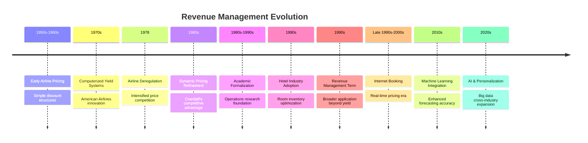

```mermaid
timeline
    title Revenue Management Evolution
    1950s-1960s : Early Airline Pricing
                : Simple discount structures
    1970s : Computerized Yield Systems
          : American Airlines innovation
    1978 : Airline Deregulation
         : Intensified price competition
    1980s : Dynamic Pricing Refinement
          : Crandall's competitive advantage
    1980s-1990s : Academic Formalization
                : Operations research foundation
    1990s : Hotel Industry Adoption
          : Room inventory optimization
    1990s : Revenue Management Term
          : Broader application beyond yield
    Late 1990s-2000s : Internet Booking
                     : Real-time pricing era
    2010s : Machine Learning Integration
          : Enhanced forecasting accuracy
    2020s : AI & Personalization
          : Big data cross-industry expansion
```
