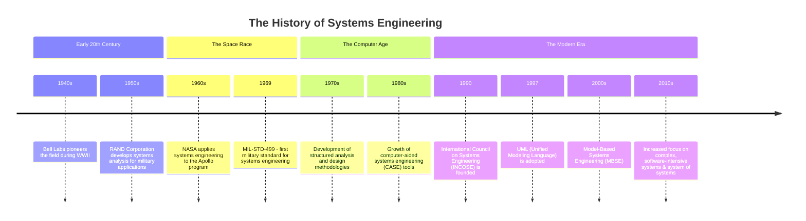

```mermaid
timeline
    title The History of Systems Engineering
    section Early 20th Century
        1940s : Bell Labs pioneers the field during WWII
        1950s : RAND Corporation develops systems analysis for military applications
    section The Space Race
        1960s : NASA applies systems engineering to the Apollo program
        1969 : MIL-STD-499 - first military standard for systems engineering
    section The Computer Age
        1970s : Development of structured analysis and design methodologies
        1980s : Growth of computer-aided systems engineering (CASE) tools
    section The Modern Era
        1990 : International Council on Systems Engineering (INCOSE) is founded
        1997 : UML (Unified Modeling Language) is adopted
        2000s : Model-Based Systems Engineering (MBSE)
        2010s : Increased focus on complex, software-intensive systems & system of systems
```
