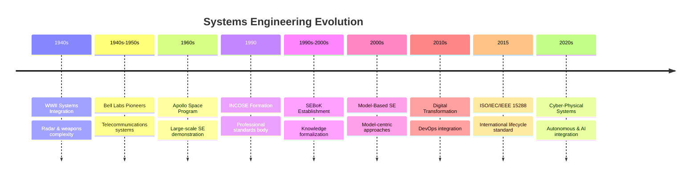

```mermaid
timeline
    title Systems Engineering Evolution
    1940s : WWII Systems Integration
          : Radar & weapons complexity
    1940s-1950s : Bell Labs Pioneers
                : Telecommunications systems
    1960s : Apollo Space Program
          : Large-scale SE demonstration
    1990 : INCOSE Formation
         : Professional standards body
    1990s-2000s : SEBoK Establishment
                : Knowledge formalization
    2000s : Model-Based SE
          : Model-centric approaches
    2010s : Digital Transformation
          : DevOps integration
    2015 : ISO/IEC/IEEE 15288
         : International lifecycle standard
    2020s : Cyber-Physical Systems
          : Autonomous & AI integration
```
