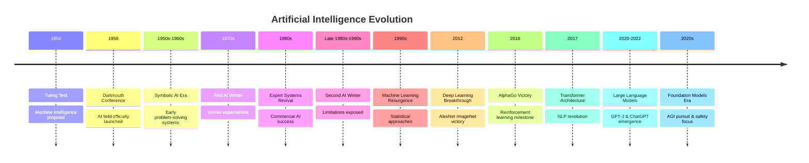

```mermaid
timeline
    title Artificial Intelligence Evolution
    1950 : Turing Test
         : Machine intelligence proposal
    1956 : Dartmouth Conference
         : AI field officially launched
    1950s-1960s : Symbolic AI Era
                : Early problem-solving systems
    1970s : First AI Winter
          : Unmet expectations
    1980s : Expert Systems Revival
          : Commercial AI success
    Late 1980s-1990s : Second AI Winter
                     : Limitations exposed
    1990s : Machine Learning Resurgence
          : Statistical approaches
    2012 : Deep Learning Breakthrough
         : AlexNet ImageNet victory
    2016 : AlphaGo Victory
         : Reinforcement learning milestone
    2017 : Transformer Architecture
         : NLP revolution
    2020-2022 : Large Language Models
              : GPT-3 & ChatGPT emergence
    2020s : Foundation Models Era
          : AGI pursuit & safety focus
```
