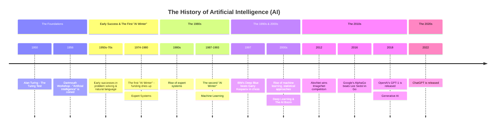

```mermaid
timeline
    title The History of Artificial Intelligence (AI)
    section The Foundations
        1950 : Alan Turing - The Turing Test
        1956 : Dartmouth Workshop - "Artificial Intelligence" is coined
    section Early Success & The First "AI Winter"
        1950s-70s : Early successes in problem solving & natural language
        1974-1980 : The first "AI Winter" - funding dries up
    section The 1980s: Expert Systems
        1980s : Rise of expert systems
        1987-1993 : The second "AI Winter"
    section The 1990s & 2000s: Machine Learning
        1997 : IBM's Deep Blue beats Garry Kasparov in chess
        2000s : Rise of machine learning, statistical approaches
    section The 2010s: Deep Learning & The AI Boom
        2012 : AlexNet wins ImageNet competition
        2016 : Google's AlphaGo beats Lee Sedol in Go
        2018 : OpenAI's GPT-1 is released
    section The 2020s: Generative AI
        2022 : ChatGPT is released
```
