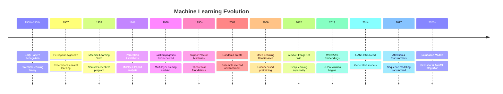

```mermaid
timeline
    title Machine Learning Evolution
    1950s-1960s : Early Pattern Recognition
                : Statistical learning theory
    1957 : Perceptron Algorithm
         : Rosenbaum's neural learning
    1959 : Machine Learning Term
         : Samuel's checkers program
    1969 : Perceptron Limitations
         : Minsky & Papert analysis
    1986 : Backpropagation Rediscovered
         : Multi-layer training enabled
    1990s : Support Vector Machines
          : Theoretical foundations
    2001 : Random Forests
         : Ensemble method advancement
    2006 : Deep Learning Renaissance
         : Unsupervised pretraining
    2012 : AlexNet ImageNet Win
         : Deep learning superiority
    2013 : Word2Vec Embeddings
         : NLP revolution begins
    2014 : GANs Introduced
         : Generative models
    2017 : Attention & Transformers
         : Sequence modeling transformed
    2020s : Foundation Models
          : Few-shot & AutoML integration
```
