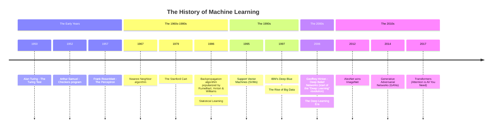

```mermaid
timeline
    title The History of Machine Learning
    section The Early Years
        1950 : Alan Turing - The Turing Test
        1952 : Arthur Samuel - Checkers program
        1957 : Frank Rosenblatt - The Perceptron
    section The 1960s-1980s
        1967 : Nearest Neighbor algorithm
        1979 : The Stanford Cart
        1986 : Backpropagation algorithm popularized by Rumelhart, Hinton & Williams
    section The 1990s: Statistical Learning
        1995 : Support Vector Machines (SVMs)
        1997 : IBM's Deep Blue
    section The 2000s: The Rise of Big Data
        2006 : Geoffrey Hinton - Deep Belief Networks (start of the "Deep Learning" revolution)
    section The 2010s: The Deep Learning Era
        2012 : AlexNet wins ImageNet
        2014 : Generative Adversarial Networks (GANs)
        2017 : Transformers (Attention is All You Need)
```
