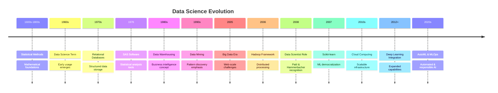

```mermaid
timeline
    title Data Science Evolution
    1600s-1800s : Statistical Methods
                : Mathematical foundations
    1960s : Data Science Term
          : Early usage emerges
    1970s : Relational Databases
          : Structured data storage
    1976 : SAS Software
         : Statistical analysis tools
    1980s : Data Warehousing
          : Business intelligence concept
    1990s : Data Mining
          : Pattern discovery emphasis
    2005 : Big Data Era
         : Web-scale challenges
    2006 : Hadoop Framework
         : Distributed processing
    2008 : Data Scientist Role
         : Patil & Hammerbacher recognition
    2007 : Scikit-learn
         : ML democratization
    2010s : Cloud Computing
          : Scalable infrastructure
    2012+ : Deep Learning Integration
          : Expanded capabilities
    2020s : AutoML & MLOps
          : Automated & responsible AI
```
