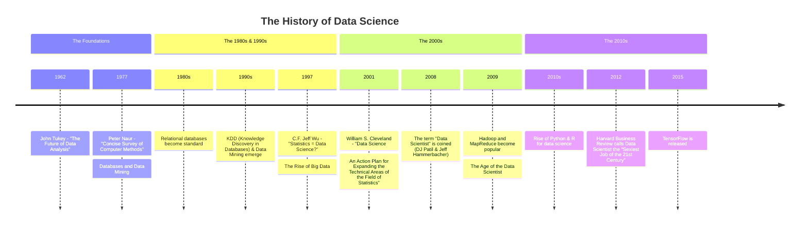

```mermaid
timeline
    title The History of Data Science
    section The Foundations
        1962 : John Tukey - "The Future of Data Analysis"
        1977 : Peter Naur - "Concise Survey of Computer Methods"
    section The 1980s & 1990s: Databases and Data Mining
        1980s : Relational databases become standard
        1990s : KDD (Knowledge Discovery in Databases) & Data Mining emerge
        1997 : C.F. Jeff Wu - "Statistics = Data Science?"
    section The 2000s: The Rise of Big Data
        2001 : William S. Cleveland - "Data Science: An Action Plan for Expanding the Technical Areas of the Field of Statistics"
        2008 : The term "Data Scientist" is coined (DJ Patil & Jeff Hammerbacher)
        2009 : Hadoop and MapReduce become popular
    section The 2010s: The Age of the Data Scientist
        2010s : Rise of Python & R for data science
        2012 : Harvard Business Review calls Data Scientist the "Sexiest Job of the 21st Century"
        2015 : TensorFlow is released
```
