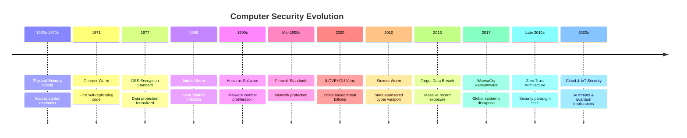

```mermaid
timeline
    title Computer Security Evolution
    1960s-1970s : Physical Security Focus
                : Access control emphasis
    1971 : Creeper Worm
         : First self-replicating code
    1977 : DES Encryption Standard
         : Data protection formalized
    1988 : Morris Worm
         : 10% internet infection
    1990s : Antivirus Software
          : Malware combat proliferation
    Mid-1990s : Firewall Standards
              : Network protection
    2000 : ILOVEYOU Virus
         : Email-based threat billions
    2010 : Stuxnet Worm
         : State-sponsored cyber weapon
    2013 : Target Data Breach
         : Massive record exposure
    2017 : WannaCry Ransomware
         : Global epidemic disruption
    Late 2010s : Zero Trust Architecture
               : Security paradigm shift
    2020s : Cloud & IoT Security
          : AI threats & quantum implications
```
