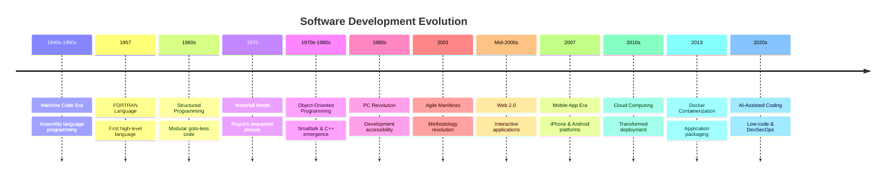

```mermaid
timeline
    title Software Development Evolution
    1940s-1950s : Machine Code Era
                : Assembly language programming
    1957 : FORTRAN Language
         : First high-level language
    1960s : Structured Programming
          : Modular goto-less code
    1970 : Waterfall Model
         : Royce's sequential phases
    1970s-1980s : Object-Oriented Programming
                : Smalltalk & C++ emergence
    1980s : PC Revolution
          : Development accessibility
    2001 : Agile Manifesto
         : Methodology revolution
    Mid-2000s : Web 2.0
              : Interactive applications
    2007 : Mobile App Era
         : iPhone & Android platforms
    2010s : Cloud Computing
          : Transformed deployment
    2013 : Docker Containerization
         : Application packaging
    2020s : AI-Assisted Coding
          : Low-code & DevSecOps
```
