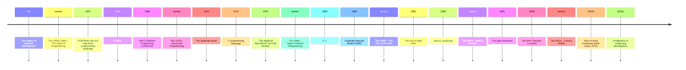

```mermaid
timeline
    title: The History of Software Development
    section: The 1950s-1960s - The Dawn of Programming
        1957: FORTRAN, the first high-level programming language
        1959: COBOL
        1968: NATO Software Engineering Conference
    section: The 1970s - Structured Programming
        1970: The Waterfall model
        1972: C programming language
        1975: "The Mythical Man-Month" by Fred Brooks
    section: The 1980s - Object-Oriented Programming
        1983: C++
        1986: Capability Maturity Model (CMM)
    section: The 1990s - The Rise of the Web
        1991: The World Wide Web
        1995: Java & JavaScript
    section: The 2000s - Agile & DevOps
        2001: The Agile Manifesto
        2009: The term "DevOps" is coined
    section: The 2010s - Cloud & Mobile
        2010s: Rise of cloud computing (AWS, Azure, GCP)
        2010s: Proliferation of mobile app development
```
