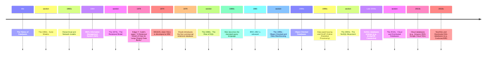

```mermaid
timeline
    title: The History of Databases
    section: The 1960s - Early Models
        1960s: Hierarchical and Network models
        1964: IBM's Information Management System (IMS)
    section: The 1970s - The Relational Model
        1970: Edgar F. Codd's paper "A Relational Model of Data for Large Shared Data Banks"
        1974: SEQUEL (later SQL) is developed at IBM
        1979: Oracle introduces the first commercial relational database
    section: The 1980s - The Rise of SQL
        1980s: SQL becomes the standard query language
        1983: IBM's DB2 is released
    section: The 1990s - Object-Oriented and Data Warehousing
        1990s: Object-Oriented Databases
        1990s: Data warehousing and OLAP (Online Analytical Processing)
    section: The 2000s - The NoSQL Movement
        Late 2000s: NoSQL databases emerge (e.g., MongoDB, Cassandra)
    section: The 2010s - Cloud and Distributed Databases
        2010s: Cloud databases (e.g., Amazon RDS, Google Cloud SQL)
        2010s: NewSQL and Distributed SQL databases (e.g., CockroachDB)
```
