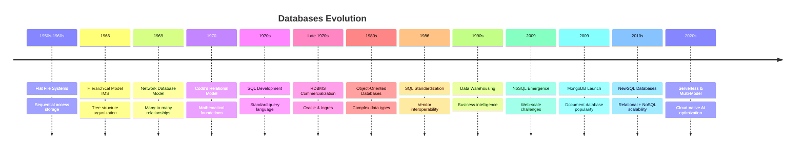

```mermaid
timeline
    title Databases Evolution
    1950s-1960s : Flat File Systems
                : Sequential access storage
    1966 : Hierarchical Model IMS
         : Tree structure organization
    1969 : Network Database Model
         : Many-to-many relationships
    1970 : Codd's Relational Model
         : Mathematical foundations
    1970s : SQL Development
          : Standard query language
    Late 1970s : RDBMS Commercialization
               : Oracle & Ingres
    1980s : Object-Oriented Databases
          : Complex data types
    1986 : SQL Standardization
         : Vendor interoperability
    1990s : Data Warehousing
          : Business intelligence
    2009 : NoSQL Emergence
         : Web-scale challenges
    2009 : MongoDB Launch
         : Document database popularity
    2010s : NewSQL Databases
          : Relational + NoSQL scalability
    2020s : Serverless & Multi-Model
          : Cloud-native AI optimization
```
