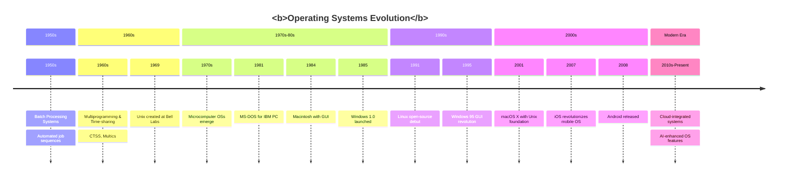

```mermaid
timeline
    title <b>Operating Systems Evolution</b>
    
    section 1950s
        1950s : Batch Processing Systems
              : Automated job sequences
    
    section 1960s
        1960s : Multiprogramming & Time-sharing
              : CTSS, Multics
        1969  : Unix created at Bell Labs
    
    section 1970s-80s
        1970s : Microcomputer OSs emerge
        1981  : MS-DOS for IBM PC
        1984  : Macintosh with GUI
        1985  : Windows 1.0 launched
    
    section 1990s
        1991  : Linux open-source debut
        1995  : Windows 95 GUI revolution
    
    section 2000s
        2001  : macOS X with Unix foundation
        2007  : iOS revolutionizes mobile OS
        2008  : Android released
    
    section Modern Era
        2010s-Present : Cloud-integrated systems
                      : AI-enhanced OS features
```
