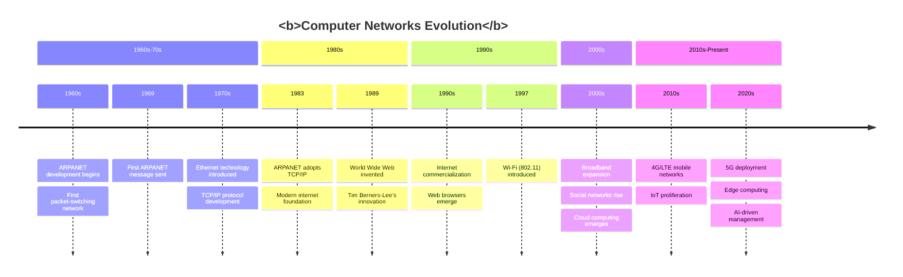

```mermaid
timeline
    title <b>Computer Networks Evolution</b>
    
    section 1960s-70s
        1960s : ARPANET development begins
              : First packet-switching network
        1969  : First ARPANET message sent
        1970s : Ethernet technology introduced
              : TCP/IP protocol development
    
    section 1980s
        1983  : ARPANET adopts TCP/IP
              : Modern internet foundation
        1989  : World Wide Web invented
              : Tim Berners-Lee's innovation
    
    section 1990s
        1990s : Internet commercialization
              : Web browsers emerge
        1997  : Wi-Fi (802.11) introduced
    
    section 2000s
        2000s : Broadband expansion
              : Social networks rise
              : Cloud computing emerges
    
    section 2010s-Present
        2010s : 4G/LTE mobile networks
              : IoT proliferation
        2020s : 5G deployment
              : Edge computing
              : AI-driven management
```
