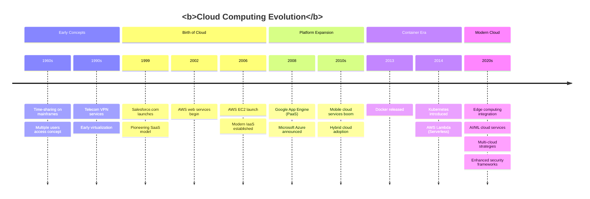

```mermaid
timeline
    title <b>Cloud Computing Evolution</b>
    
    section Early Concepts
        1960s : Time-sharing on mainframes
              : Multiple users access concept
        1990s : Telecom VPN services
              : Early virtualization
    
    section Birth of Cloud
        1999  : Salesforce.com launches
              : Pioneering SaaS model
        2002  : AWS web services begin
        2006  : AWS EC2 launch
              : Modern IaaS established
    
    section Platform Expansion
        2008  : Google App Engine (PaaS)
              : Microsoft Azure announced
        2010s : Mobile cloud services boom
              : Hybrid cloud adoption
    
    section Container Era
        2013  : Docker released
        2014  : Kubernetes introduced
              : AWS Lambda (Serverless)
    
    section Modern Cloud
        2020s : Edge computing integration
              : AI/ML cloud services
              : Multi-cloud strategies
              : Enhanced security frameworks
```
