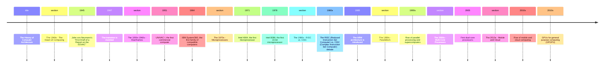

```mermaid
timeline
    title: The History of Computer Architecture
    section: The 1940s - The Dawn of Computing
        1945: John von Neumann's "First Draft of a Report on the EDVAC"
        1947: The transistor is invented
    section: The 1950s-1960s - Mainframes
        1951: UNIVAC I, the first commercial computer
        1964: IBM System/360, the first family of compatible computers
    section: The 1970s - Microprocessors
        1971: Intel 4004, the first microprocessor
        1978: Intel 8086, the first 16-bit microprocessor
    section: The 1980s - RISC vs. CISC
        1980s: The RISC (Reduced Instruction Set Computer) vs. CISC (Complex Instruction Set Computer) debate
        1985: The ARM architecture is introduced
    section: The 1990s - Parallelism
        1990s: Rise of parallel processing and supercomputers
    section: The 2000s - Multi-Core Processors
        2005: First dual-core processors
    section: The 2010s - Mobile and Cloud
        2010s: Rise of mobile and cloud computing
        2010s: GPUs for general purpose computing (GPGPU)
```
