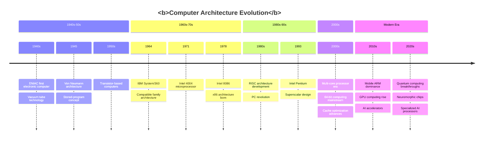

```mermaid
timeline
    title <b>Computer Architecture Evolution</b>
    
    section 1940s-50s
        1940s : ENIAC first electronic computer
              : Vacuum tube technology
        1945  : Von Neumann architecture
              : Stored-program concept
        1950s : Transistor-based computers
    
    section 1960s-70s
        1964  : IBM System/360
              : Compatible family architecture
        1971  : Intel 4004 microprocessor
        1978  : Intel 8086
              : x86 architecture born
    
    section 1980s-90s
        1980s : RISC architecture development
              : PC revolution
        1993  : Intel Pentium
              : Superscalar design
    
    section 2000s
        2000s : Multi-core processor era
              : 64-bit computing mainstream
              : Cache optimization advances
    
    section Modern Era
        2010s : Mobile ARM dominance
              : GPU computing rise
              : AI accelerators
        2020s : Quantum computing breakthroughs
              : Neuromorphic chips
              : Specialized AI processors
```
