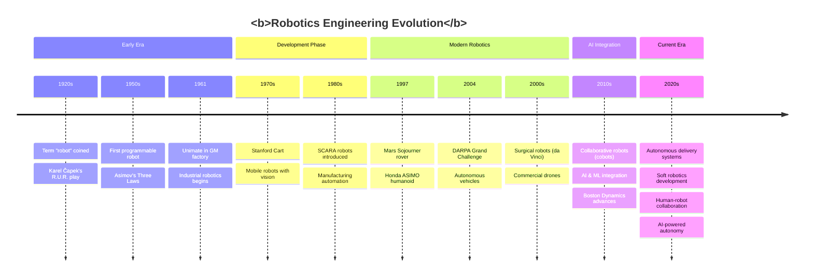

```mermaid
timeline
    title <b>Robotics Engineering Evolution</b>
    
    section Early Era
        1920s : Term "robot" coined
              : Karel Čapek's R.U.R. play
        1950s : First programmable robot
              : Asimov's Three Laws
        1961  : Unimate in GM factory
              : Industrial robotics begins
    
    section Development Phase
        1970s : Stanford Cart
              : Mobile robots with vision
        1980s : SCARA robots introduced
              : Manufacturing automation
    
    section Modern Robotics
        1997  : Mars Sojourner rover
              : Honda ASIMO humanoid
        2004  : DARPA Grand Challenge
              : Autonomous vehicles
        2000s : Surgical robots (da Vinci)
              : Commercial drones
    
    section AI Integration
        2010s : Collaborative robots (cobots)
              : AI & ML integration
              : Boston Dynamics advances
    
    section Current Era
        2020s : Autonomous delivery systems
              : Soft robotics development
              : Human-robot collaboration
              : AI-powered autonomy
```
