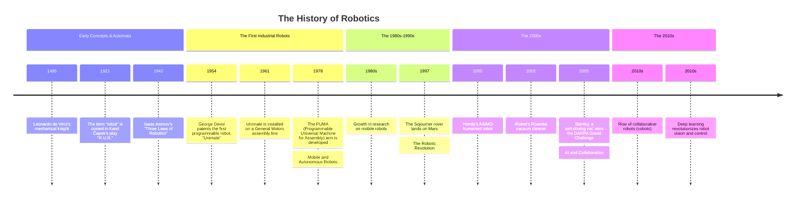

```mermaid
timeline
    title The History of Robotics
    section Early Concepts & Automata
        1495 : Leonardo da Vinci's mechanical knight
        1921 : The term "robot" is coined in Karel Čapek's play "R.U.R."
        1942 : Isaac Asimov's "Three Laws of Robotics"
    section The First Industrial Robots
        1954 : George Devol patents the first programmable robot, "Unimate"
        1961 : Unimate is installed on a General Motors assembly line
        1978 : The PUMA (Programmable Universal Machine for Assembly) arm is developed
    section The 1980s-1990s: Mobile and Autonomous Robots
        1980s : Growth in research on mobile robots
        1997 : The Sojourner rover lands on Mars
    section The 2000s: The Robotic Revolution
        2000 : Honda's ASIMO humanoid robot
        2002 : iRobot's Roomba vacuum cleaner
        2005 : Stanley, a self-driving car, wins the DARPA Grand Challenge
    section The 2010s: AI and Collaboration
        2010s : Rise of collaborative robots (cobots)
        2010s : Deep learning revolutionizes robot vision and control
```
