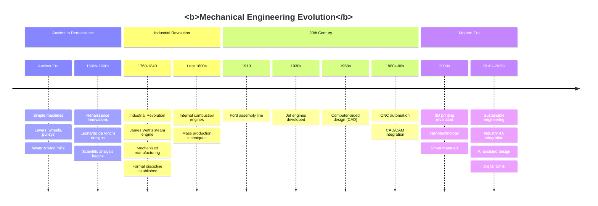

```mermaid
timeline
    title <b>Mechanical Engineering Evolution</b>
    
    section Ancient to Renaissance
        Ancient Era : Simple machines
                    : Levers, wheels, pulleys
                    : Water & wind mills
        1500s-1600s : Renaissance innovations
                    : Leonardo da Vinci's designs
                    : Scientific analysis begins
    
    section Industrial Revolution
        1760-1840 : Industrial Revolution
                  : James Watt's steam engine
                  : Mechanized manufacturing
                  : Formal discipline established
        Late 1800s : Internal combustion engines
                   : Mass production techniques
    
    section 20th Century
        1913  : Ford assembly line
        1930s : Jet engines developed
        1960s : Computer-aided design (CAD)
        1980s-90s : CNC automation
                  : CAD/CAM integration
    
    section Modern Era
        2000s : 3D printing revolution
              : Nanotechnology
              : Smart materials
        2010s-2020s : Sustainable engineering
                    : Industry 4.0 integration
                    : AI-assisted design
                    : Digital twins
```
