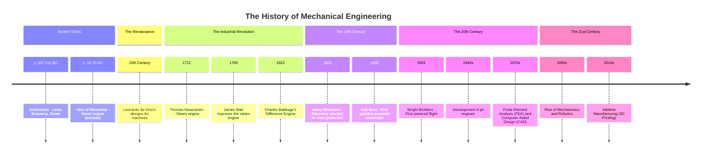

```mermaid
timeline
    title The History of Mechanical Engineering
    section Ancient Times
        c. 287-212 BC : Archimedes - Lever, Buoyancy, Screw
        c. 10-70 AD : Hero of Alexandria - Steam engine (aeolipile)
    section The Renaissance
        15th Century : Leonardo da Vinci's designs for machines
    section The Industrial Revolution
        1712 : Thomas Newcomen - Steam engine
        1769 : James Watt improves the steam engine
        1822 : Charles Babbage's Difference Engine
    section The 19th Century
        1855 : Henry Bessemer - Bessemer process for steel production
        1886 : Karl Benz - First gasoline-powered automobile
    section The 20th Century
        1903 : Wright Brothers - First powered flight
        1940s : Development of jet engines
        1970s : Finite Element Analysis (FEA) and Computer-Aided Design (CAD)
    section The 21st Century
        2000s : Rise of Mechatronics and Robotics
        2010s : Additive Manufacturing (3D Printing)
```
