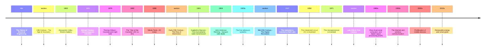

```mermaid
timeline
    title: The History of Electrical Engineering
    section: 19th Century - The Age of Discovery
        1800: Alessandro Volta - Electric battery
        1831: Michael Faraday - Electromagnetic induction
        1879: Thomas Edison - Incandescent light bulb
        1882: The "War of the Currents" (AC vs. DC)
        1888: Nikola Tesla - AC motor
    section: Early 20th Century - The Rise of Electronics
        1901: Guglielmo Marconi - First transatlantic radio transmission
        1904: John Ambrose Fleming - Vacuum tube diode
        1920s: The first television systems
    section: Mid-20th Century - The Digital Revolution
        1947: The transistor is invented at Bell Labs
        1958: The integrated circuit (IC) is invented
        1971: The microprocessor is invented
    section: Late 20th & 21st Century
        1980s: Rise of personal computers and digital signal processing (DSP)
        1990s: The Internet and wireless communication
        2000s: Proliferation of mobile devices
        2010s: Renewable energy and smart grids
```
