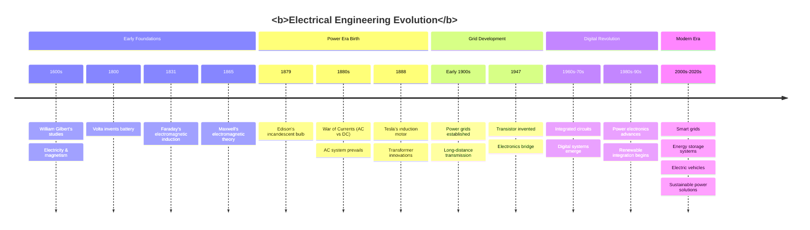

```mermaid
timeline
    title <b>Electrical Engineering Evolution</b>
    
    section Early Foundations
        1600s : William Gilbert's studies
              : Electricity & magnetism
        1800  : Volta invents battery
        1831  : Faraday's electromagnetic induction
        1865  : Maxwell's electromagnetic theory
    
    section Power Era Birth
        1879  : Edison's incandescent bulb
        1880s : War of Currents (AC vs DC)
              : AC system prevails
        1888  : Tesla's induction motor
              : Transformer innovations
    
    section Grid Development
        Early 1900s : Power grids established
                    : Long-distance transmission
        1947  : Transistor invented
              : Electronics bridge
    
    section Digital Revolution
        1960s-70s : Integrated circuits
                  : Digital systems emerge
        1980s-90s : Power electronics advances
                  : Renewable integration begins
    
    section Modern Era
        2000s-2020s : Smart grids
                    : Energy storage systems
                    : Electric vehicles
                    : Sustainable power solutions
```
